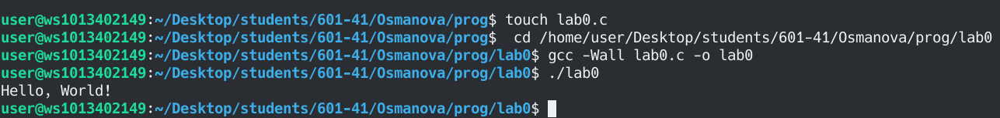
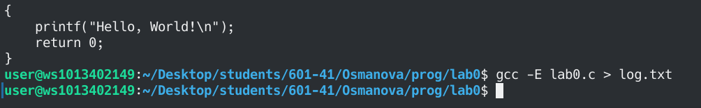
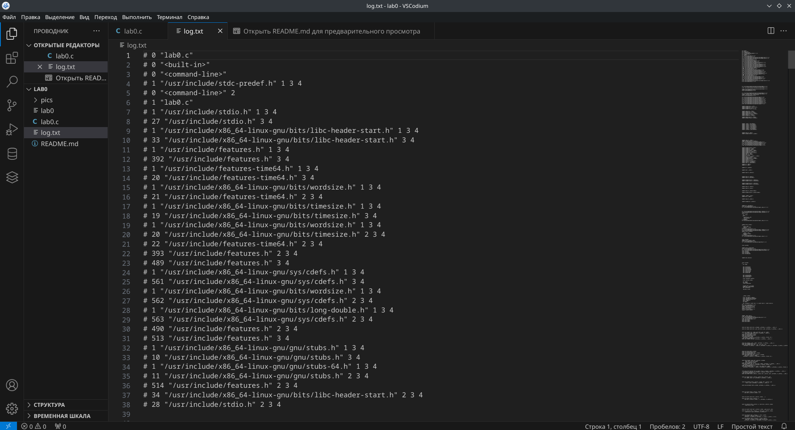
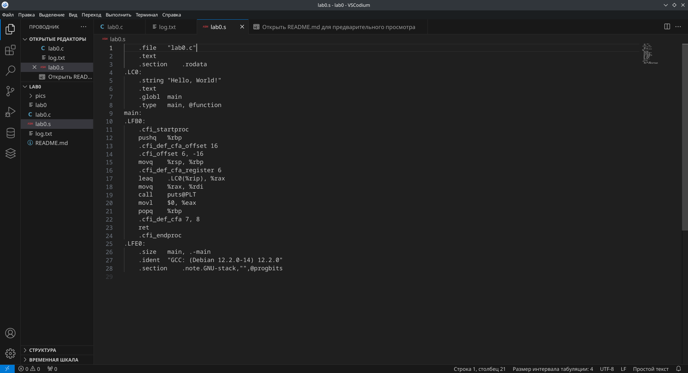
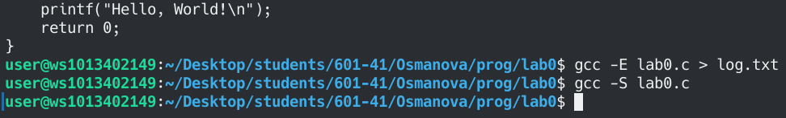
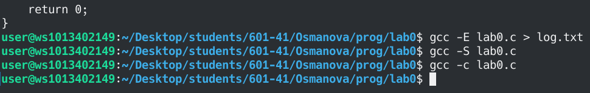

# ОТЧЕТ
## Задание
1.Создайте репозиторий для дисциплины на GitHub.

2.Склонируйте его себе на ПК.

3.Напишите свою первую программу.

4.Скомпилируйте и запустите её.

5.Получите по отдельности результаты каждого этапа компиляции.

## Консольные команды:
git clone https://github.com/llloo123

git init

Переинициализирован существующий репозиторий Git в /home/user/lab0/.git/

git add .

git commit -m "First commit"

git push

gcc -Wall 1.c -o 1

ls 

./1

git add .

git commit -m 

## Результаты вычислений

```c
#include <stdio.h>

int main()
{
    printf("Hello, World!\n");
    return 0;
} 
```

1. Полная сборка программы и запуск использованного файла программы:
 

2. Получен вывод препроцессора файла log.txt:


3. Содержимое файла log.txt:
 

4. Получен ассемблерный код в файле lab0.s:
 

5. Содержимое файла lab0.s:
 

6. Получен объектный файл lab0.o:
 
