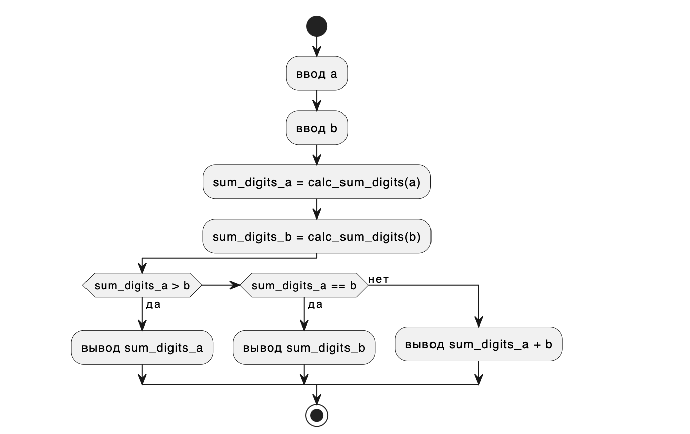

## Отчет 
## Лабораторная №1
## Вариант 1
Вывести сумму цифр числа a если она больше b, если равна b - сообщение Сумма цифр b, 
и значение суммы, увеличенное на b, если сумма меньше b.
## Задания
1. Разобрать код программы из примера;
2. Составить блок-схему алгоритма для своего варианта;
3. Написать программу, рещающую задачу по своему варианту;
4. Оформить отчет.

## Программа
```c
#include <stdio.h>

int calc_sum_digits(int num)
{
    int sum_digits = 0;
    while(num != 0) {
        sum_digits += num % 10;
        num = num / 10;
    }   
    return sum_digits;
}

int main()
{
    int a, b;
    printf("Enter a -> ");
    scanf("%d", &a);
    printf("Enter b -> ");
    scanf("%d", &b);

    int sum_digits_a, sum_digits_b;
    sum_digits_a = calc_sum_digits(a);
    sum_digits_b = calc_sum_digits(b);

    if (sum_digits_a > b)
        printf("sum_digits_a = %d\n", sum_digits_a);
    if (sum_digits_a == b)
        printf("sum_digits_b = %d\n", sum_digits_b);
    if (sum_digits_a < b)
       printf("sum_digits_a + b = %d\n", sum_digits_a + b);
    return 0;
}
```

## Результат работы


## Блок-схема


## Источники 
(https://programforyou.ru/block-diagram-redactor)
(https://evil-teacher.on.fleek.co/prog_pm/term1/lab01/)
(https://doka.guide/tools/markdown/)
