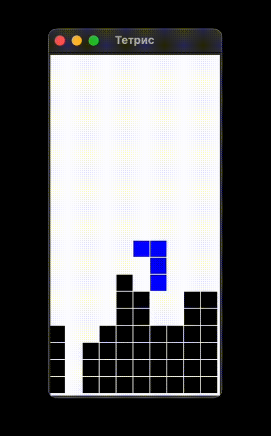

# Лабораторная работа 11
## Задание 
Реализуйте приложение с GUI (приложения-игры допускается делать с использованием TUI-пакетов) по своему варианту. Можно изменить задание на собственную тему, согласовав с преподавателем.
Оформите README.md. 

## Тетрис

### Проделанная работа
```py
import tkinter as tk
import random

# Константы
GRID_SIZE = 20
GRID_WIDTH = 10
GRID_HEIGHT = 20

class Tetris:
    def __init__(self, root):
        self.root = root
        self.root.title("Тетрис")
        self.canvas = tk.Canvas(root, width=GRID_WIDTH*GRID_SIZE, height=GRID_HEIGHT*GRID_SIZE, bg="white")
        self.canvas.pack()
        self.grid = [[0 for _ in range(GRID_WIDTH)] for _ in range(GRID_HEIGHT)]
        self.current_piece = None
        self.start_game()


    def start_game(self):
        self.generate_new_piece()
        self.update()


    def generate_new_piece(self):
        shapes = [
            [[1, 1, 1, 1]],  # I
            [[1, 0, 0], [1, 1, 1]],  # J
            [[0, 0, 1], [1, 1, 1]],  # L
            [[1, 1], [1, 1]],  # O
            [[0, 1, 1], [1, 1, 0]],  # S
            [[0, 1, 0], [1, 1, 1]],  # T
            [[1, 1, 0], [0, 1, 1]],  # Z
        ]
        self.current_piece_shape = random.choice(shapes)
        self.current_piece_x = GRID_WIDTH // 2 - len(self.current_piece_shape[0]) // 2
        self.current_piece_y = 0

    def can_move_down(self):
        for i, row in enumerate(self.current_piece_shape):
            for j, cell in enumerate(row):
                if cell == 1:
                   new_y = self.current_piece_y + i + 1
                   if new_y >= GRID_HEIGHT or self.grid[new_y][self.current_piece_x+j] == 1:
                       return False
        return True


    def move_piece_down(self):
        if self.can_move_down():
             self.current_piece_y+=1
        else:
            self.freeze_piece()
            self.clear_lines()
            self.generate_new_piece()


    def freeze_piece(self):
         for i,row in enumerate(self.current_piece_shape):
            for j, cell in enumerate(row):
                if cell == 1:
                  self.grid[self.current_piece_y + i][self.current_piece_x+j] = 1

    def clear_lines(self):
        rows_to_clear = []
        for i, row in enumerate(self.grid):
           if all(cell == 1 for cell in row):
               rows_to_clear.append(i)
        for row_index in rows_to_clear[::-1]: #выполняем повторение в обратном порядке
            del self.grid[row_index]
            self.grid.insert(0,[0 for _ in range(GRID_WIDTH)])


    def draw_grid(self):
       self.canvas.delete("all") 

       for row_index, row in enumerate(self.grid):
          for cell_index,cell_val in enumerate(row):
             if cell_val == 1:
                 x1 = cell_index * GRID_SIZE
                 y1 = row_index * GRID_SIZE
                 x2 = x1 + GRID_SIZE
                 y2 = y1 + GRID_SIZE
                 self.canvas.create_rectangle(x1, y1, x2, y2, fill="black")
       #Изображение текущего фрагмента
       if self.current_piece_shape:
           for i,row in enumerate(self.current_piece_shape):
              for j, cell in enumerate(row):
                 if cell==1:
                    x1 = (self.current_piece_x+j) * GRID_SIZE
                    y1 = (self.current_piece_y + i)* GRID_SIZE
                    x2 = x1 + GRID_SIZE
                    y2 = y1 + GRID_SIZE
                    self.canvas.create_rectangle(x1,y1,x2,y2,fill="blue")

    def update(self):
      self.move_piece_down()
      self.draw_grid()
      self.root.after(500,self.update) # обновление вызова через 500 мс


    def move_piece(self,dx):
        if self.current_piece_shape:
            if self.can_move_side(dx):
               self.current_piece_x+=dx


    def can_move_side(self,dx):
         for i,row in enumerate(self.current_piece_shape):
            for j, cell in enumerate(row):
                 if cell==1:
                    new_x = self.current_piece_x+j +dx
                    if new_x <0 or new_x >= GRID_WIDTH or self.grid[self.current_piece_y + i][new_x] == 1:
                        return False
         return True


    def rotate_piece(self):

         if self.current_piece_shape:
            rotated_shape = self.rotate_matrix(self.current_piece_shape)
            if self.can_move_rotated(rotated_shape):
                self.current_piece_shape = rotated_shape

    def can_move_rotated(self,rotated_shape):
       for i,row in enumerate(rotated_shape):
            for j, cell in enumerate(row):
                 if cell==1:
                    x = self.current_piece_x + j
                    y = self.current_piece_y + i
                    if x<0 or x >= GRID_WIDTH or y >= GRID_HEIGHT or (y >=0 and self.grid[y][x] ==1) :
                        return False
       return True


    def rotate_matrix(self, matrix):
        num_rows = len(matrix)
        num_cols = len(matrix[0])
        rotated = [[0 for _ in range(num_rows)] for _ in range(num_cols)]
        for i in range(num_rows):
            for j in range(num_cols):
                rotated[j][num_rows - 1 - i] = matrix[i][j]
        return rotated


root = tk.Tk()
tetris = Tetris(root)

root.bind("<Left>", lambda event: tetris.move_piece(-1))
root.bind("<Right>", lambda event: tetris.move_piece(1))
root.bind("<Down>", lambda event: tetris.move_piece_down())
root.bind("<Up>", lambda event: tetris.rotate_piece())


root.mainloop()
```

