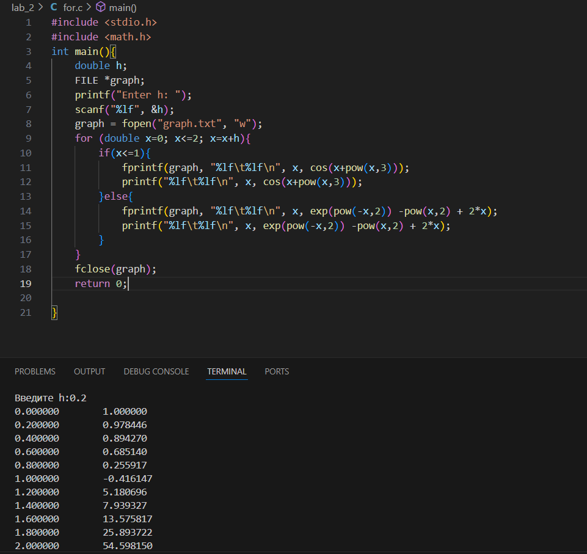

# Отчет по лабораторной работе №2
## Вариант 1
## Задание 
1. **Написать программу по варианту, используя оператор цикла** `while`
2. **Написать программу, используя цикл** `for`
3. **Построить график с ипользованием** `gnuplot`
4. **Составить блок-схему**
5. **Оформить отчёт в** `readme.md`
### Задание варианта 
$$
f(x) =
  \begin{cases}
    cos{(x+x^3)} \text{,}       & 0 \leq x \leq 1 \text{;} \\
    e^{-x^2} -{x^2} + 2x \text{,} & 1 < x \leq 2 \text{.}
  \end{cases}
$$
## Ход работы:
1. **Код с циклом `while`**
```c
#include <stdio.h>
#include <math.h>
int main(){
    double h, x=0;
    FILE *graph;
    printf("Введите h:");
    scanf("%lf", &h);
    graph = fopen("my_graph.txt", "w");
    while(x<=2+(h/2)){
        if(x<=1){
            fprintf(graph, "%lf\t%lf\n", x, cos(x+pow(x,3)));
            printf("%lf\t%lf\n", x, cos(x+pow(x,3)));
        }else{
            fprintf(graph, "%lf\t%lf\n", x, exp(pow(-x,2)) -pow(x,2) + 2*x);
            printf("%lf\t%lf\n", x, exp(pow(-x,2)) -pow(x,2) + 2*x);
        }
        x+=h;
    }
    fclose(graph);
    return 0;
}  
```
2. **Код с циклом `for`**
```c
#include <stdio.h>
#include <math.h>
int main(){
    double h;
    FILE *graph;
    printf("Enter h: ");
    scanf("%lf", &h);
    graph = fopen("graph.txt", "w");
    for (double x=0; x<=2; x=x+h){
        if(x<=1){
            fprintf(graph, "%lf\t%lf\n", x, cos(x+pow(x,3)));
            printf("%lf\t%lf\n", x, cos(x+pow(x,3)));
        }else{
            fprintf(graph, "%lf\t%lf\n", x, exp(pow(-x,2)) -pow(x,2) + 2*x);
            printf("%lf\t%lf\n", x, exp(pow(-x,2)) -pow(x,2) + 2*x);
        }
    }
    fclose(graph);
    return 0;
        
}
```

# Результаты работы
**Цикл `while`**


**Цикл `for`**



# Блок-схемы
**Цикл `while`**


**Цикл `for`**


## График фунцкии


## Справочные материалы
[Блок-схема](https://programforyou.ru/block-diagram-redactor)
[График функции](https://www.cyberforum.ru/attachments/460666d1417376612)
[Помощь](https://studassistent.ru/c/vyvesti-tablicu-znacheniy-funkcii-c-si)
