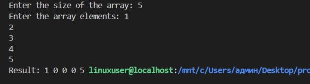

# Лабораторная работа №3
## Вариант 1
Найти сумму индексов максимального и минимального элемента массива, если она меньше/больше по модулю минимума/максимума соответственно, записать её на их место, иначе обнулить массив между минимум и максимумом.

## Задание
1. Выполнить задание своего варианта
2. Сделать скриншот результата
3. Составить отчет 

## Описание проделанной работы
- Программа
```
#include <stdio.h>
#include <stdlib.h>

int main() {
    int n, min_element, max_element, min_index = 0, max_index = 0, sum;
    
    printf("Enter the size of the array: ");
    scanf("%d", &n);

    int arr[n];
    
    printf("Enter the array elements: ");
    for (int i = 0; i < n; i++) {
        scanf("%d", &arr[i]);
    }

    // Нахождение минимума и максимума,и их индексов
    min_element = arr[0];
    max_element = arr[0];
    for (int i = 1; i < n; i++) {
        if (arr[i] < min_element) {
            min_element = arr[i];
            min_index = i;
        }
        if (arr[i] > max_element) {
            max_element = arr[i];
            max_index = i;
        }
    }

    // Вычисление суммы индексов
    sum = min_index + max_index;

    // Проверка условий и обработка массива
    if (abs(sum) < abs(min_element) || abs(sum) > abs(max_element)) {
        arr[min_index] = sum;
        arr[max_index] = sum;
    } else {
        if (min_index < max_index) {
            for (int i = min_index + 1; i < max_index; i++) {
                arr[i] = 0;
            }
        } else {
            for (int i = max_index + 1; i < min_index; i++) {
                arr[i] = 0;
            }
        }
    }
    printf("MIN index: %d\n", min_index);
    printf("MAX index: %d\n", max_index);
    printf("SUM index: %d\n", sum);
    printf("Result: ");
    for (int i = 0; i < n; i++) {
        printf("%d ", arr[i]);
    }

    return 0;
}
```
### Результат программы


#### Источники
- https://evil-teacher.on.fleek.co/prog_pm/term1/lab03/
- https://doka.guide/tools/markdown/
