# Отчёт по лабораторной работе №4
## Задания:
1. Скачать архив и распаковать его в свой репозиторий. В нём 11 заданий, которые нужно выполнить.
2. Оформить отчёт в README.md.
## Ход работы 
Скачала и распаковала архив. Выполнено 11 заданий.
#### Задание 0
- Cловарь словарей расстояний между городами:

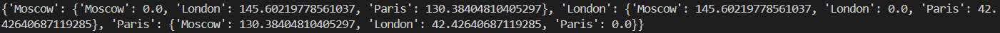

#### Задание 1
- Вывела на консоль значение прощади данного круга,а так же узнала лежат ли точки внутри него(True/False).
  
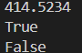

#### Задание 2
- Расставила знаки операций "плюс", "минус", "умножение" и скобки.
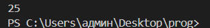

#### Задание 3
- Вывела на консоль с помощью индексации строки последовательно:первый фильм,последний,второй,второй с конца.
  
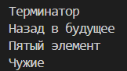

#### Задание 4
- Создала списки моей семьи и их роста,затем вывела рост отца и сумарный рост всей семьи.
  
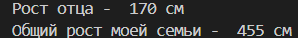

#### Задание 5
- Посадила медведя между львом и кенгуру.Добавила птиц из списка birds в последние клетки зоопарка.Уберала слона.Вывела на консоль в какой клетке сидит лев и жаворонок.
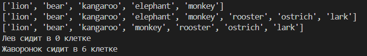

#### Задание 6
- Распечатала общее время звучания трех песен: 'Halo', 'Enjoy the Silence' и 'Clean'.Распечатала общее время звучания трех песен: 'Sweetest Perfection', 'Policy of Truth' и 'Blue Dress'.
  
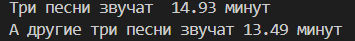

#### Задание 7
- Расшифровала запечатанное сообщение и вывела на консоль в удобочитаемом виде.
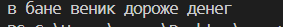

#### Задание 8
- Создала множество цветов, произрастающих в саду и на лугу.Вывела на консоль все виды цветов.Вывела на консоль те, которые растут и там и там.Вывела на консоль те, которые растут в саду, но не растут на лугу.Вывела на консоль те, которые растут на лугу, но не растут в саду.
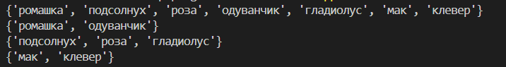

#### Задание 9
- Словарь цен на продкты. Вывела на консоль 2 магазина с минимальными ценнами.
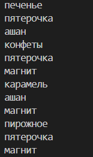

#### Задание 10
- Рассчитала на какую сумму лежит каждого товара на складе.Вывела стоимость каждого вида товара на складе.
  
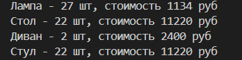

### Используемые материалы:
- https://doka.guide/tools/markdown/
- https://evil-teacher.on.fleek.co/prog_pm/term1/lab04/
- https://docs.python.org/3/tutorial/
