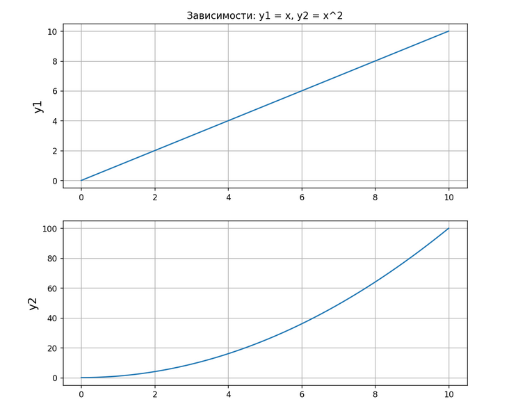

# Лабораторная работа №5 
## Задание 
1) Создайте в каталоге для данной ЛР в своём репозитории виртуальное окружение и установите в него ```matplotlib``` и ```numpy```. Создайте файл ```requirements.txt```.
2) Откройте книгу [1] и выполните уроки 1-3. Первый урок можно начинать со стр. 8.
3) Выберите одну из неразрывных функции своего варианта из лабораторной работы №2, постройте график этой функции и касательную к ней. Добавьте на график заголовок, подписи осей, легенду, сетку, а также аннотацию к точке касания.
4) Добавьте в корень своего репозитория файл .gitignore отсюда, перед тем как делать очередной коммит.
5) Оформите отчёт в README.md. Отчёт должен содержать:
- графики, построенные во время выполнения уроков из книги
- объяснения процесса решения и график по заданию 4
6) Склонируйте этот репозиторий НЕ в ваш репозиторий, а рядом. Изучите использование этого инструмента и создайте pdf-версию своего отчёта из README.md. Добавьте её в репозиторий.

## Ход работы
1. Cоздал “пустое” виртуальное окружение с помощью команды `python3 -m venv env` 
2. Активировал виртуальное окружение командой `source env/bin/activate`
3. Обновил пакетный менеджер командой `pip install -U pip`
4. Установил необходимые пакеты с помощью команды `pip install 'пакеты'`
5. Перенёс все установленные пакеты в новое окружение: `pip freeze > requirements.txt`
6. Далее на “новом месте” создаЛ пустое окружение, обновил пакетный менеджер и затем выполнил `pip install -r requirements.txt`

## Выполнение уроков
### Урок 1.2
``` python
import matplotlib.pyplot as plt

plt.plot([1,2,3,4,5],[1,2,3,4,5])
plt.show()
```

### Урок 1.3
``` python
import matplotlib.pyplot as plt
import numpy as np

# Независимая (x) и зависимая (y) переменные
x = np.linspace(0, 10, 50)
y = x
# Построение графика
plt.title('Линейная зависимость y = x') # заголовок
plt.xlabel('x') # ось абсцисс
plt.ylabel('y') # ось ординат
plt.grid()      
# включение отображение сетки
plt.plot(x, y)  # построение графика
plt.show()
```

### Урок 1.4
``` python
import matplotlib.pyplot as plt
import numpy as np

x = np.linspace(0,10,50)
y1 = x #линейная зависимость
y2 = [i**2 for i in x] #квадратичная зависимость

plt.title('Зависимость: y1 = x, y2 = x^2') #заголовок
plt.xlabel('x') # ось абсцисс
plt.ylabel('y1, y2') # ось ординат   
plt.grid() # включение отображение сетки
plt.plot(x, y1, x, y2) # построение графика
plt.show()
```


### Урок 1.5
``` python
import matplotlib.pyplot as plt
import numpy as np

x = np.linspace(0,10,50)
y1 = x #линейная зависимость
y2 = [i**2 for i in x] #квадратичная зависимость

plt.figure(figsize=(9, 9)) #построение графика
plt.subplot(2, 1, 1)
plt.plot(x, y1) #построение графика            
plt.title('Зависимости: y1 = x, y2 = x^2') #заголовок
plt.ylabel('y1', fontsize=14) #ось ординат
plt.grid(True) #ось ординат    

plt.subplot(2, 1, 2)
plt.plot(x, y2) #gостроение графика         
plt.xlabel('x', fontsize=14) #ось абсцисс   
plt.ylabel('y2', fontsize=14) #ось ординат  
plt.grid(True) #включение отображение сетки                 

plt.show()
```


### Урок 1.6
``` python
import matplotlib.pyplot as plt

fruits = ['apple', 'peach', 'orange', 'bannana', 'melon'] #название фруктов
counts = [34, 25, 43, 31, 17] #количество фруктов
plt.bar(fruits, counts) #построение вертикальной столбчатой диаграммы
plt.title('Fruits!') #заголовок
plt.xlabel('Fruit') #ось абцисс
plt.ylabel('Count') #ось ординат
plt.show()
```

### Урок 2.1 + 2.2
``` python
import matplotlib.pyplot as plt

x = [1, 5, 10, 15, 20]
y = [1, 7, 3, 5, 11]
plt.plot(x, y, label = 'steel price') #по оси ординат (ось y), а по оси абсцисс (ось x) будут отложены индексы элементов массива
plt.xlabel('Day', fontsize=15, color='blue')
plt.title('График', fontsize=17)
plt.ylabel('Price', fontsize=15, color='blue')
plt.legend()
plt.grid(True)
plt.text(15, 4, 'grow up!')
plt.show()
```

### Урок 2.3
``` python
import matplotlib.pyplot as plt

x = [1, 5, 10, 15, 20]
y = [1, 7, 3, 5, 11]
plt.plot(x, y, '--r')
plt.show()
```

### Урок 2.4
``` python
import matplotlib.pyplot as plt

x = [1, 5, 10, 15, 20]
y1 = [1, 7, 3, 5, 11]
y2 = [i*1.2 + 1 for i in y1]
y3 = [i*1.2 + 1 for i in y2]
y4 = [i*1.2 + 1 for i in y3]
# Настройка размеров подложки
plt.figure(figsize=(12, 7))
plt.subplot(2, 2, 1)
plt.plot(x, y1, '-')
plt.subplot(2, 2, 2)
plt.plot(x, y2, '--')
plt.subplot(2, 2, 3)
plt.plot(x, y3, '-.')
plt.subplot(2, 2, 4)
plt.plot(x, y4, ':')
plt.show()
```

### Урок 2.5
``` python
import matplotlib.pyplot as plt

x = [1, 5, 10, 15, 20]
y1 = [1, 7, 3, 5, 11]
y2 = [i*1.2 + 1 for i in y1]
y3 = [i*1.2 + 1 for i in y2]
y4 = [i*1.2 + 1 for i in y3]
plt.plot(x, y1, '-', x, y2, '--', x, y3, '-.', x, y4, ':')
plt.show()
```

### Урок 3.1
``` python
import matplotlib.pyplot as plt

locs = ['best', 'upper right', 'upper left', 'lower left',
'lower right', 'right', 'center left', 'center right',
'lower center', 'upper center', 'center']
x = [1, 5, 10, 15, 20]
y1 = [1, 7, 3, 5, 11]
y2 = [4, 3, 1, 8, 12]
plt.figure(figsize=(12, 12))
for i in range(3):
    for j in range(4):
        if i*4+j < 11:
           plt.subplot(3, 4, i*4+j+1)
           plt.title(locs[i*4+j])
           plt.plot(x, y1, 'o-r', label='line 1')
           plt.plot(x, y2, 'o-.g', label='line 2')
           plt.legend(loc=locs[i*4+j])
        else:
            break
plt.show()
```
