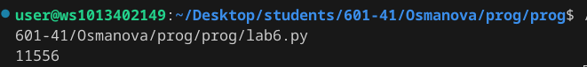
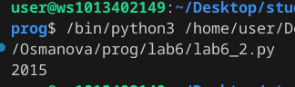

# Отчет. Лабораторная №6
## Задачи 
1. Написать программы для своего варианта
2. Оформить отчет 
## Вариант 1
- Задание №1. Тимофей составляет 5-буквенные коды из букв Т, И, М, О, Ф, Е, Й. Буква Й может использоваться в коде не более одного раза, при этом она не может стоять на первом месте, на последнем месте и рядом с буквой И. Все остальные буквы могут встречаться произвольное количество раз или не встречаться совсем. Сколько различных кодов может составить Тимофей?
## Программа №1
```py
from itertools import product
count = 0
for x in product ('тимофей', repeat = 5):
    s = ''.join(x)
    if s.count('й') <= 1 and 'йи' not in s and 'ий' not in s and s[0] != 'й' and s[1:] != 'й':
        count += 1
print(count)
```
## Результат


- Задание №2.Сколько единиц содержится в двоичной записи значения выражения 42020+22017−15 4 ^ {2020} + 2 ^ {2017} − 15?
## Программа №2
```py
print(bin(4**2020 + 2**2017 - 15)[2:].count('1'))
```
## Результат

