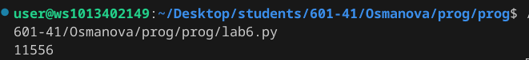
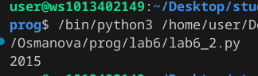
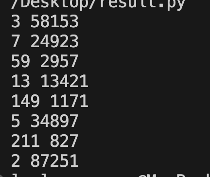

# Отчет. Лабораторная №6
## Вариант 1
### Задачи 
1. Написать программы для своего варианта
2. Оформить отчет
   
## Задание №1. 
- Условие:
  
  Тимофей составляет 5-буквенные коды из букв Т, И, М, О, Ф, Е, Й. Буква Й может использоваться в коде не более одного раза, при этом она не может стоять на первом месте, на последнем месте и рядом с буквой И. Все остальные буквы могут встречаться произвольное количество раз или не встречаться совсем. Сколько различных кодов может составить Тимофей?
- Программа №1
```py
from itertools import product
count = 0
for x in product ('тимофей', repeat = 5):
    s = ''.join(x)
    if s.count('й') <= 1 and 'йи' not in s and 'ий' not in s and s[0] != 'й' and s[1:] != 'й':
        count += 1
print(count)
```
- Результат №1

  

## Задание №2.
- Условие:
  
  Сколько единиц содержится в двоичной записи значения выражения $4^{2020} + 2^{2017} − 15$?
- Программа №2
```py
print(bin(4**2020 + 2**2017 - 15)[2:].count('1'))
```
- Результат №2
 
  

## Задание №3.
- Условие:
  
  Найдите среди целых чисел, принадлежащих числовому отрезку [174457; 174505], числа, имеющие ровно два различных натуральных делителя, не считая единицы и самого числа. Для каждого найденного числа запишите эти два делителя в два соседних столбца на экране с новой строки в порядке возрастания произведения этих двух делителей. Делители в строке также должны следовать в порядке возрастания. 
  
- Программа №3
```py
a = 174457
b = 174505
k = 0
for n in range(a, b + 1):
    ds = []
    for d in range(2, n//2 + 1):
        if n % d == 0:
            ds.append(d)
            if len(ds) > 2:
                break
    if len(ds) == 2:
        print(ds[0], ds[1])
```
- Результат №3
 
  

#### Источники
- https://evil-teacher.on.fleek.co/prog_pm/term1/lab03/
- https://doka.guide/tools/markdown/
