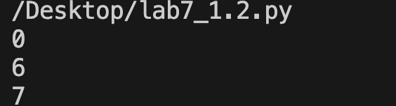
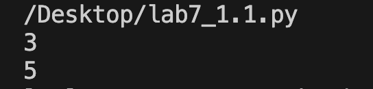

# Отчет Лабораторной №7
## Вариант 1
### Задание 
1. Написать две функции для решения задач своего варианта - с использованием рекурсии и без.
2. Оформить отчёт в README.md.

### Задача №1
   Функция для подсчёта числа элементов в списках, включая вложенные списки:
```py
>>> count([])
0
>>> count([1, 2, 3])
3
>>> count(["x", "y", ["z"]])
4
>>> count([1, 2, [3, 4, [5]]])
7
```
#### Решение с помощью рекурсии 
```py
def count_recursive(data):
    count = 0
    if isinstance(data, list):
        for item in data:
            count += count_recursive(item) + 1 
        return count
    else:
        return 1  
print(count_recursive([]))      
print(count_recursive([1, 2, 3]))  
print(count_recursive(["x", "y", ["z"]]))
```
- Вывод программы
  
 
#### Решение без помощи рекурсии (итеративный)
```py
def count_iterative(data):
    count = 0
    stack = [data] 
    while stack:
        current = stack.pop()
        if isinstance(current, list):
            stack.extend(current)  
        else:
            count += 1
    return count
print(count_iterative(["x", "y", ["z"]])) 
print(count_iterative([1, 2, [3, 4, [5]]])) 
```
- Вывод программы  
 
### Задача №2
Функция для расчёта
  
   $x_i = \frac{(i-1)x_{i-1}}{3} + \frac{(i-2)x_{i-2}}{4}$ ​​, $x_1​= 1$, $x_2​= −1/8$

### Решение с помощью рекурсии 
```py
def calc_x(i):
    if i == 1:
        return 1
    elif i == 2:
        return -1/8
    else:
        return ((i - 1)*calc_x(i - 1)) / 3 + ((i - 2)*calc_x(i - 2)) / 4
print(calc_x(3))
print(calc_x(7))
```
- Вывод программы

  .png)
  
#### Решение без помощи рекурсии 
```py
def calc_x_iterative(n):
    if n == 1:
        return 1
    elif n == 2:
        return -1/8
    else:
        x_values = [1, -1/8]
        for i in range(3, n + 1):
            next_x = ((i - 1) * x_values[-1]) / 3 + ((i - 2) * x_values[-2]) / 4
            x_values.append(next_x)
        return x_values[-1]
print(calc_x_iterative(3))
print(calc_x_iterative(7))
```
- Вывод программы

.png)

#### Источники:
https://proglib.io/p/samouchitel-po-python-dlya-nachinayushchih-chast-13-rekursivnye-funkcii-2023-01-23
https://habr.com/ru/articles/337030/
    
