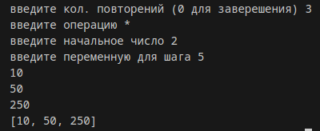
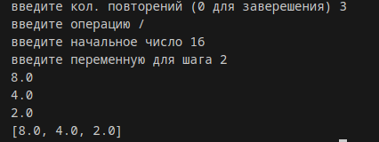
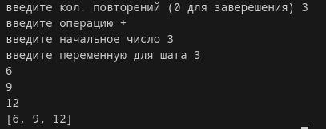
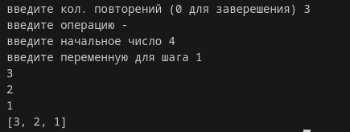

# Лабораторная работа №8 
## Вариант 1
## Задание 
1) Решите обе задачи своего варианта.
2) Примените декоратор к замыканию.
3) Оформите отчёт в README.md. 
### Задание варианта
- Замыкание-калькулятор, накапливающее результат и поддерживающее 4 арифметичесике операции:
```py
>>> calc = make_calc("*", initial=1)
>>> calc(5)
5
>>> calc(2)
10
```
- Декоратор, который будет запускать функцию указанное число раз с указанными параметрами и возвращать последвательность результатов.
## Проделанная работа 
```py
def calc(op, i=0):
    result = i
    def operation(i):
        nonlocal result
        if op == "+":
            result += i
        elif op == "-":
            result -= i
        elif op == "*":
            result *= i
        elif op == "/":
            result /= i
        print(result)
        return result
    return operation


def povtor(kol):
    def decorator(step):
        def schet(*args, **kwargs):
            result = []
            for _ in range(kol):
                result.append(step(*args, **kwargs))
            return result
        return schet
    return decorator


while (True):
    kol=int(input("введите кол. повторений (0 для заверешения) "))
    if kol==0:
        break

    op=input("введите операцию ")

    i=int(input("введите начальное число "))

    forstep=int(input("введите переменную для шага "))
    test = calc(op, i)

    @povtor(kol)
    def step(forstep):
        return test(forstep)

    print(step(forstep)) 
```
### Результаты работы
- Умножение 



- Деление




- Сложение 



- Вычитание 




