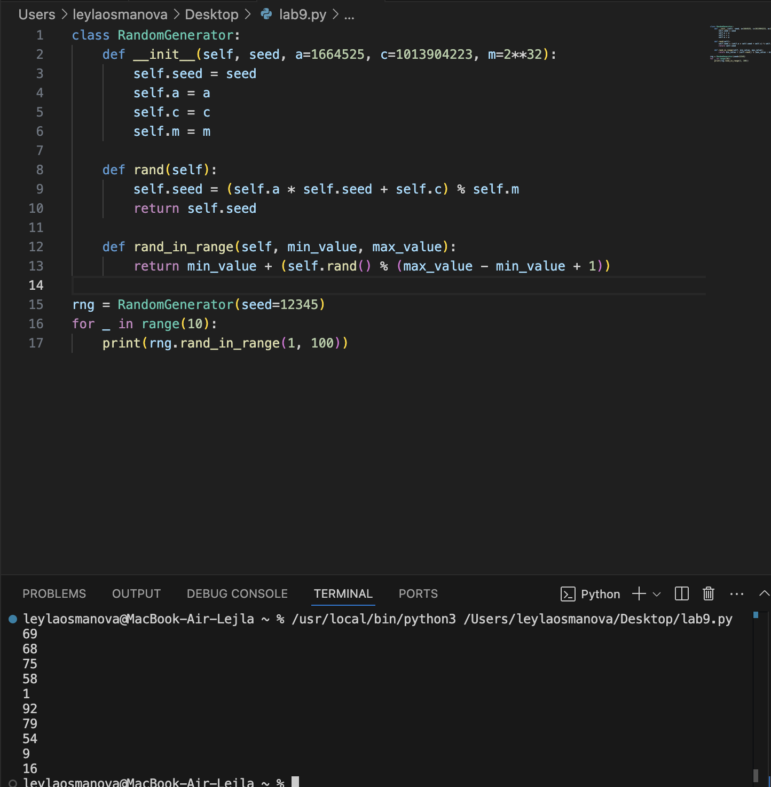

# Лабораторная работа №9 
## Вариант 1
## Задание
1) Решите задачу своего варианта.
2) Оформите отчёт в README.md. Отчёт должен содержать:
    - Условия задач
    - Описание проделанной работы
    - Скриншоты результатов
    - Ссылки на используемые материалы
### Задание варианта
Генератор случайных чисел в заданном диапазоне. Не используйте готовые реализации ГПСЧ.
## Ход работы
```py
class RandomGenerator:
    def __init__(self, seed, a=1664525, c=1013904223, m=2**32):
        self.seed = seed
        self.a = a
        self.c = c
        self.m = m

    def rand(self):
        self.seed = (self.a * self.seed + self.c) % self.m
        return self.seed

    def rand_in_range(self, min_value, max_value):
        return min_value + (self.rand() % (max_value - min_value + 1))

rng = RandomGenerator(seed=12345)
for _ in range(10):
    print(rng.rand_in_range(1, 100))
```
Класс RandomGenerator:
Инициализируется начальным значением (seed), коэффициентами a, c и модулем m.
Метод rand генерирует следующее псевдослучайное число в последовательности.
Метод rand_in_range возвращает случайное число в заданном диапазоне [min_value, max_value].
Использование генератора:
Создаем экземпляр класса RandomGenerator с начальным значением seed.
Вызываем метод rand_in_range для генерации случайного числа в указанном диапазоне.

### Результат работы

